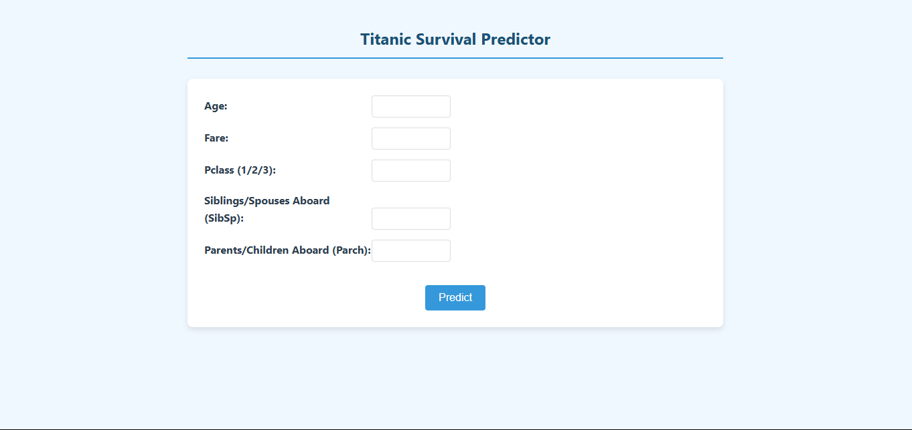
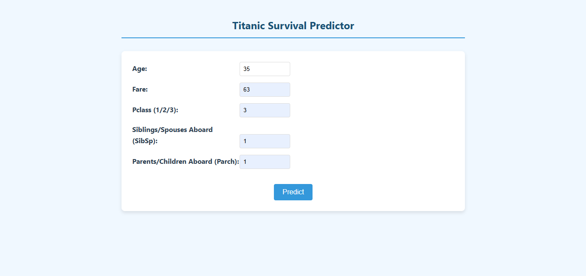
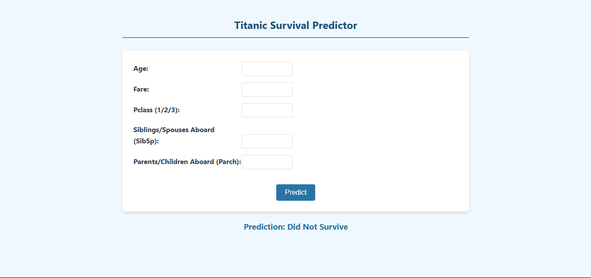

# Titanic Survival Prediction using Logistic Regression and Flask

This project is a simple machine learning web app that predicts whether a Titanic passenger would have survived based on features like age, fare, class, and number of family members aboard. It uses **Logistic Regression** for prediction and is deployed using **Flask**.

---

## Features

- Preprocessing of Titanic dataset (missing values, label encoding, scaling)
- Feature correlation heatmap for exploratory data analysis
- Logistic Regression model for binary classification (Survived/Not Survived)
- Web interface built with Flask for real-time prediction
- Clean UI for entering passenger details

---

## Tech Stack

- **Python**
- **Pandas**, **NumPy**, **Matplotlib**, **Seaborn**
- **Scikit-learn** (Logistic Regression, preprocessing)
- **Flask** (Web framework)
- **HTML** (Frontend via Jinja2 templates)

---

## How to Run Locally

1. **Clone the repository**
   ```bash
   git clone https://github.com/divyapranav/Titanic-Survival-Logistic-Regression-.git
   cd Titanic-Survival-Logistic-Regression-
   ```

2. **Install dependencies**
   ```bash
   pip install -r requirements.txt
   ```

3. **Train the model and save it**
   ```bash
   python model_train.py
   ```

4. **Run the Flask app**
   ```bash
   python app.py
   ```

5. **Visit the app in your browser**
   ```
   http://127.0.0.1:5000
   ```

---

## Project Structure

```
titanic_flask_app/
│
├── app.py                # Flask web app
├── model_train.py    # Model training and saving script
├── model.pkl             # Trained Logistic Regression model
├── scaler.pkl            # Fitted StandardScaler
├── templates/
│   └── index.html        # Frontend UI (Jinja2 template)
├── README.md             # Project documentation
└── requirements.txt      # Python dependencies
```

---

## Example Input Fields

- Age
- Fare
- Passenger Class (1, 2, 3)
- Siblings/Spouses aboard (SibSp) (Yes/No as 1 and 0)
- Parents/Children aboard (Parch) (Yes/No as 1 and 0)

---

## Model Performance

The Logistic Regression model gives reasonable accuracy on test data and is suitable for binary classification in this classic dataset. Evaluation metrics like accuracy and classification report are printed during training.

## Working Screenshots






---